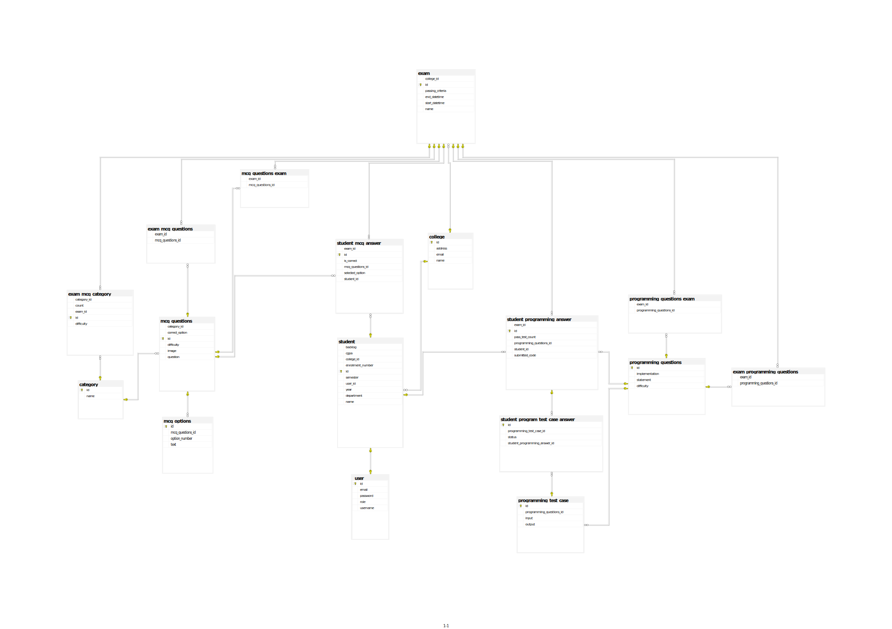

**Examination System Project**
==========================

This is an online examination system project that allows multiple students to give online interviews. The system provides a user-friendly interface for students to attempt exams and for administrators to manage the exam process.

**Getting Started**
---------------

Before running the application, please note the following:

* Create a database named `examinationDB` in your database management system.
* Update the `application.properties` file with your database username and password.

**User Control API Endpoints**
---------------------------

The following API endpoints are available for user control:

### User Endpoints

#### GET Endpoints

* `GET /get/all`: Get all users
* `GET /get/{id}`: Get a user by ID
* `GET /get/email`: Get a user by email
* `GET /get/role`: Get users by role

#### POST Endpoints

* `POST /add`: Add a new user

#### PUT Endpoints

* `PUT /update/{userId}`: Update a user

#### DELETE Endpoints

* `DELETE /delete/{id}`: Delete a user by ID

**Note**: This is not an exhaustive list of API endpoints. Additional endpoints may be added as the project evolves.

**ERD**
---------------------------

