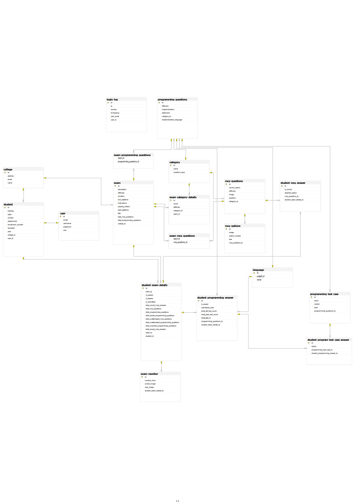

**Examination System Project**
==========================

This is an online examination system project that allows multiple students to give online interviews. The system provides a user-friendly interface for students to attempt exams and for administrators to manage the exam process.

**Getting Started**
---------------

Before running the application, please note the following:

* Create a database named `examinationDB` in your database management system.
* Update the `application.properties` file with your database username and password.

**Project Highlights**
---------------------------

* All "must-have" and "nice-to-have" features for the backend have been implemented successfully.
* This project utilizes the open-source Judge0 API for code compilation and test case evaluation.
* All Images of project are saved in local storage instead of database.
* Images are deleted from local storage after delete operations.
* Efficiently handled 'Data Import' from Excel files.There are two types of action while data import 1) TEST 2) SUBMIT.
* For my practice have implemented some of redundant GET requests in the project.

**Postman API Documentation**
---------------------------

For detailed API documentation, refer to the Postman API documentation:
[Postman API Documentation](https://documenter.getpostman.com/view/29290869/2sAYJ9BKD2)

**ERD**
---------------------------

